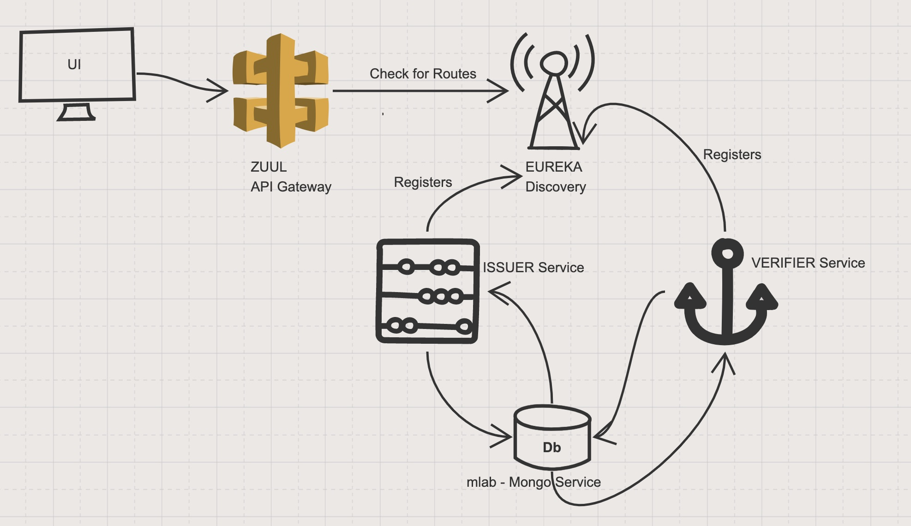

# REGISTER-DID

A POC on Decentralised Identifiers

DB: I am using mlab that provides mongo as a service to store data.

## With Docker

```
cd register-did
docker-compose up --build --remove-orphans
```

This will bring up;

```
Eureka Server - JAVA
ZUUL Server - JAVA
Register DID Issuer - NodeJS
Register DID Verifier - NodeJS
Register DID UI - ReactJS
```

Note: For the first time, it will be slow as it will build the images. I have not published them to the docker-registry for simplicity

Once its up, UI can be accessed via, http://localhost:3005/

## API Documentation

Issuer
http://localhost:8081/did-issuer/api-docs/

Verifier
http://localhost:8081/did-verifier/api-docs/

## Without Docker

```
cd register-did

cd eureka
java -jar eureka-service-vk.jar

cd zuul
java -jar zuul-service-vk.jar

cd register-did-service-issuer
npm install
npm start

cd register-did-service-verfier
npm install
npm start

cd register-did-ui
npm install
npm build
npm start or npm run start-dev
```

## API Documentation

Issuer
http://localhost:3003/api-docs

Verifier
http://localhost:3004/api-docs

# Test Frameworks

NodeJS - Mocha, Chai, Supertest
ReactJS - Jest

To run tests

```
cd register-did-service-issuer
npm install
npm test

cd register-did-service-verifier
npm install
npm test

cd register-did-ui
npm install
npm test
```

# Demo


# High Level Architecture


